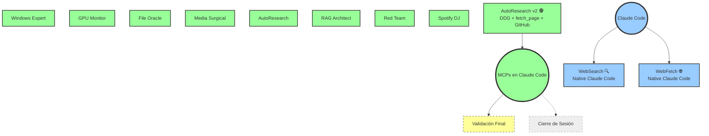

# Progress Map

Actualizado el: Sun Apr 19 02:30:00 2026

```mermaid
graph TD
    Windows_Expert[Windows Expert]
    style Windows_Expert fill:#9f9,stroke:#333,stroke-width:2px
    GPU_Monitor[GPU Monitor]
    style GPU_Monitor fill:#9f9,stroke:#333,stroke-width:2px
    File_Oracle[File Oracle]
    style File_Oracle fill:#9f9,stroke:#333,stroke-width:2px
    Media_Surgical[Media Surgical]
    style Media_Surgical fill:#9f9,stroke:#333,stroke-width:2px
    AutoResearch[AutoResearch]
    style AutoResearch fill:#9f9,stroke:#333,stroke-width:2px
    RAG_Architect[RAG Architect]
    style RAG_Architect fill:#9f9,stroke:#333,stroke-width:2px
    Red_Team[Red Team]
    style Red_Team fill:#9f9,stroke:#333,stroke-width:2px
    Spotify_DJ[Spotify DJ]
    style Spotify_DJ fill:#9f9,stroke:#333,stroke-width:2px
    MCP_Registrados((MCPs en Claude Code))
    style MCP_Registrados fill:#9f9,stroke:#333,stroke-width:4px
    MCP_Registrados --> Validación_Final[Validación Final]
    style Validación_Final fill:#ff9,stroke:#333,stroke-dasharray: 5 5
    MCP_Registrados -.-> Cierre_de_Sesión[Cierre de Sesión]
    style Cierre_de_Sesión fill:#eee,stroke:#999,stroke-dasharray: 5 5
    WebSearch[WebSearch 🔍<br/>Native Claude Code]
    style WebSearch fill:#9cf,stroke:#333,stroke-width:2px
    WebFetch[WebFetch 🌐<br/>Native Claude Code]
    style WebFetch fill:#9cf,stroke:#333,stroke-width:2px
    AutoResearch_V2[AutoResearch v2 🕵️<br/>DDG + fetch_page + GitHub]
    style AutoResearch_V2 fill:#9f9,stroke:#333,stroke-width:2px
    Claude_Code((Claude Code))
    style Claude_Code fill:#9cf,stroke:#333,stroke-width:4px
    Claude_Code --> WebSearch
    Claude_Code --> WebFetch
    AutoResearch_V2 --> MCP_Registrados
```
